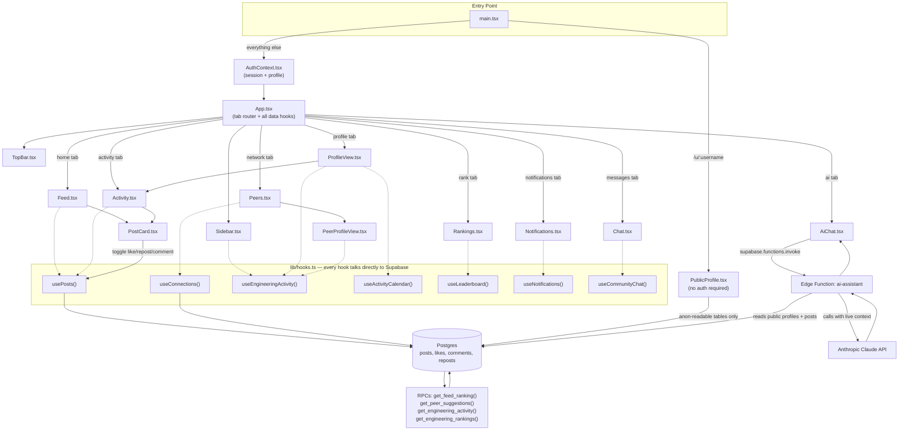

# Engineer Network

**Proof-of-work portfolios for engineering students.**

Engineer Network is a social platform where engineering students post real, verifiable work — code, projects, GitHub links, videos, images — instead of resume claims. Every action (like, comment, repost, connection) feeds a transparent, server-computed reputation and ranking system. No fabricated stats, no vanity metrics: everything you see in the product is backed by a real row in the database.

Think: **LinkedIn's network** + **GitHub's proof-of-work** + **an AI assistant that actually knows your community** + **a feed ranked by a real algorithm, not by who posted last.**

---

## What makes this different

Most student/professional networks reward *presence* (login streaks, follower counts, polished bios). This platform rewards **output**:

- A **Reputation Score** that only grows when other people genuinely engage with your work (like +2, comment +3, repost +5 — see [`ALGORITHM.md`](ALGORITHM.md)).
- A **feed ranking algorithm** combining engagement, time-decay, difficulty, author quality, your personal network affinity, and a "new member" discovery boost — computed entirely in Postgres so it can't be gamed from the browser.
- A **public shareable profile** (`/u/<username>`) that works with zero login — a real "proof of work" resume link.
- An **AI assistant** with live, read-only access to the platform's public data (every member, their skills, their posts) — ask it "who should I collaborate with on a web-dev project?" and it actually knows.
- **Engineering Activity** metrics (Active Days, Projects Built, Open Source Contributions, Research Activity, Community Contributions, AI Impact Score) computed live from real posts/likes/comments — not a login-streak gimmick.

---

## Tech stack

| Layer | Technology |
|---|---|
| Frontend | React 19 + TypeScript (strict) + Vite |
| Styling | Hand-rolled CSS custom properties (`src/index.css`) — no Tailwind/UI kit dependency |
| Backend | Supabase (Postgres + Auth + Realtime + Storage + Edge Functions) |
| AI | Anthropic Claude, called from a Supabase Edge Function (`ai-assistant`) |
| Hosting | Vercel (SPA rewrite configured in `vercel.json`) |
| Icons | `lucide-react` |

Everything that looks like "data" in the UI is real: posts, likes, connections, rankings, and AI answers are all backed by live Postgres queries — nothing is hardcoded or randomly generated at render time.

---

## Project structure

```
src/
├── main.tsx                 # Entry point — routes "/" → <App/>, "/u/:username" → <PublicProfile/>
├── App.tsx                  # Root shell: tab state, data hooks, wires every screen together
├── index.css                # The entire design system (colors, radii, shadows, keyframes)
│
├── lib/
│   ├── supabase.ts          # Supabase client + every TypeScript type (Profile, Post, etc.)
│   ├── hooks.ts             # ALL data-fetching logic lives here (see below)
│   ├── AuthContext.tsx      # React context: session, profile, sign-in/out
│   ├── time.ts              # Relative/clock time formatting helpers
│   └── sound.ts             # Web Audio API notification chime (no audio files)
│
└── components/
    ├── Auth.tsx              # Multi-step animated login/signup (+ Google/GitHub OAuth)
    ├── TopBar.tsx            # Top nav: search, tab switcher, notifications bell, profile menu
    ├── Sidebar.tsx           # Left profile card + Engineering Activity summary + points bar
    ├── Feed.tsx               # Home feed: post composer (image/video upload) + ranked post list
    ├── PostCard.tsx          # Single post: like/comment/repost/share/delete/block — used by Feed AND Activity
    ├── Activity.tsx          # "My posts" — compact widget (on Profile) + full page (all activity)
    ├── Peers.tsx             # Mentors & Peers grid — connect/disconnect, opens PeerProfileView
    ├── PeerProfileView.tsx   # Another member's full profile (read-only, real Engineering Activity)
    ├── ProfileView.tsx       # Your own full profile (real contribution calendar, activity grid)
    ├── PublicProfile.tsx     # The ANONYMOUS /u/:username page — no login required
    ├── Rankings.tsx          # Engineering Rank leaderboard (composite algorithm, not raw points)
    ├── Chat.tsx              # Community chat channels (Supabase Realtime)
    ├── Notifications.tsx     # Full notifications page (connection requests, AI post analysis)
    ├── AiChat.tsx            # AI assistant page — talks to the `ai-assistant` Edge Function
    └── Avatar.tsx            # Shared avatar-with-initials-fallback component

supabase/ (managed via MCP, not committed as local migration files)
├── Postgres tables: profiles, posts, post_likes, post_comments, post_reposts,
│                     connections, chats, messages, notifications, user_blocks
├── RPCs: get_feed_ranking, get_peer_suggestions, get_engineering_activity,
│         get_engineering_rankings, get_activity_calendar, toggle_post_like,
│         toggle_post_repost, send_connection_request, award_post_points
├── Triggers: apply_engagement_points (reputation on like/comment/repost),
│              enforce_post_rate_limit (max 5 posts/hour), handle_new_user
└── Edge Function: ai-assistant (calls Anthropic's API with live platform context)

ALGORITHM.md                 # Full writeup of the ranking/reputation algorithm
vercel.json                  # SPA rewrite so /u/:username resolves on refresh
```

---

## How it all connects (data flow)



**Reading this diagram:** `main.tsx` is the only file that decides between the anonymous public-profile page and the full authenticated app. Everything inside the authenticated app flows through `App.tsx`, which owns every data hook from `lib/hooks.ts` and passes data down as props — components never call Supabase directly except through those hooks. `PostCard.tsx` is intentionally shared between the Feed and the Activity/Profile pages so a like/comment/repost/delete/block behaves identically everywhere. The AI assistant is the one feature with its own backend hop: it goes through a Supabase Edge Function (server-side, so the Anthropic API key never reaches the browser) which builds a context string from live public data before calling Claude.

---

## Core feature map

### 🔐 Auth
Multi-step animated login/signup (`Auth.tsx`) backed by Supabase Auth. Supports email/password and one-click Google/GitHub OAuth (providers must be enabled in the Supabase dashboard). `AuthContext.tsx` exposes `session`, `user`, `profile`, and `signOut()` to the whole app.

### 📰 Feed & Posts
`Feed.tsx` is the composer + ranked post list. Posting supports real image/video upload (Supabase Storage, `post-media` bucket), code snippets, and GitHub links. Every post is AI-difficulty-graded (beginner/intermediate/advanced) which feeds both the poster's points and the feed ranking algorithm.

### ❤️ Engagement & Reputation
Likes, comments, and reposts are real rows in `post_likes` / `post_comments` / `post_reposts`. A Postgres trigger (`apply_engagement_points`) automatically adjusts the author's `points` (reputation) the moment someone engages — no client-side point math, so it can't be spoofed.

### 🧮 Feed Ranking Algorithm
`get_feed_ranking()` scores every post on: engagement, time-decay, AI difficulty, author reputation, your personal connection to the author, a new-member discovery boost, and a block-penalty. Full breakdown in [`ALGORITHM.md`](ALGORITHM.md).

### 🤝 Peers & Connections
`Peers.tsx` lists every other member, ranked by `get_peer_suggestions()` (mutual connections, same college, reputation, recency). Connecting fires a real-time notification (with a sound chime) to the other user via `send_connection_request()`.

### 🏆 Engineering Rank
`Rankings.tsx` shows the platform leaderboard ordered by `get_engineering_rankings()` — a composite of reputation, activity, projects shipped, open-source output, and community contribution. Not a login streak.

### 📊 Engineering Activity
Replaces the old streak concept entirely. `get_engineering_activity()` returns eight real metrics per user (Active Days, Projects Built, Learning Sessions, Open Source Contributions, Research Activity, Community Contributions, Reputation Score, AI Impact Score), all computed live from real posts. `get_activity_calendar()` powers the GitHub-style contribution heatmap on profiles.

### 🌍 Public Profiles
`PublicProfile.tsx` renders at `/u/<username>` with **zero authentication** — the viral growth loop. A student drops this link on a resume or LinkedIn and anyone can see their verified proof of work.

### 🤖 AI Assistant
`AiChat.tsx` is a ChatGPT-style page (light theme, its own collapsible sidebar, conversation history saved locally) that calls the `ai-assistant` Supabase Edge Function. The function builds a live context block (every member's profile + recent posts) server-side and forwards it to Claude — so the AI genuinely knows the community, without ever exposing the API key to the browser.

### 🔔 Notifications
Real-time via Supabase Realtime (`postgres_changes` subscription). Connection requests trigger both a database-backed notification and a client-side sound chime for the recipient.

### 💬 Community Chat
Channel-based chat (`Chat.tsx`) backed by the `messages` table, updated live via Supabase Realtime subscriptions.

### 🚫 Blocking & Anti-Spam
Any user can block another from a post's menu — blocks are enforced at the ranking-query level (blocked authors' posts are filtered out server-side, not hidden client-side). Posting is rate-limited to 5 posts/hour by a database trigger.

---

## Getting started

```bash
npm install
cp .env.example .env   # fill in VITE_SUPABASE_URL and VITE_SUPABASE_ANON_KEY
npm run dev
```

To enable the AI assistant, add an `ANTHROPIC_API_KEY` secret in your Supabase project's Edge Function settings — no redeploy needed.

```bash
npm run build   # tsc -b && vite build — must produce zero errors
```

---

## Security model

Every table has Row Level Security enabled. Write access is scoped to `auth.uid()`; sensitive mutations (points, notifications, connection requests) go through `SECURITY DEFINER` RPCs with `EXECUTE` revoked from `anon`/`public` where appropriate, so nothing can be forged from the browser console. The public profile page only reads tables with an explicit `anon`-readable policy (`profiles`, `posts`, and their engagement tables) — nothing private is ever exposed anonymously.
